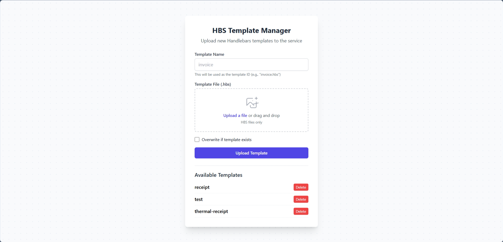

# Stasis


A high-performance (well, still gotta benchmark first), RESTful Express.js "microservice" (arguably) for generating PDF documents from Handlebars templates using Playwright headless browser.

## Features

- **RESTful API architecture** following standard conventions
- **Template-based PDF generation** from Handlebars templates with dynamic data injection
- **Raw HTML to PDF conversion** with optional template compilation
- **Built-in Tailwind CSS support** for modern styling (v4 by default)
- **File upload management** with drag-and-drop template interface
- **Bulk template upload** supporting up to 20 files simultaneously with detailed error reporting
- **Type-safe TypeScript implementation** with comprehensive error handling
- **Playwright-powered rendering** for consistent cross-platform PDF output
- **Docker-ready containerization** for scalable deployment
- **Performance monitoring middleware** with detailed benchmarking
- **Template persistence** with volume mapping for Docker deployments
- **Security features** including CSRF protection and file validation

## Technology Stack

| Category             | Technology   | Purpose                                          |
| -------------------- | ------------ | ------------------------------------------------ |
| **Backend**          | Express.js   | HTTP server and API framework                    |
| **Rendering**        | Playwright   | Headless browser for PDF generation              |
| **Templating**       | Handlebars   | Template engine for dynamic HTML                 |
| **Language**         | TypeScript   | Type-safe JavaScript superset                    |
| **Package Mgmt**     | PNPM         | Fast, disk-efficient package manager             |
| **Testing**          | Vitest       | Fast unit testing framework                      |
| **Containerization** | Docker       | Application containerization                     |
| **Styling**          | Tailwind CSS | Utility-first CSS framework for template styling |
| **Security**         | Helmet       | HTTP security headers middleware                 |

## Core Dependencies

The project uses the following main dependencies:

- **Framework**: Express.js v5.1.0 with TypeScript
- **PDF Generation**: Playwright v1.52.0 for headless browser automation
- **Templating**: Handlebars v4.7.8 for dynamic HTML templating
- **Date Handling**: date-fns v4.1.0 with French locale support
- **File Upload**: Multer v2.0.0 for multipart/form-data handling
- **Security**: Helmet v8.1.0 for HTTP security headers, CORS v2.8.5
- **Testing**: Vitest v3.1.4 for fast unit testing
- **Code Quality**: Prettier v3.5.3 for code formatting

## Project Structure

```
pdf-generator/
├── src/
│   ├── index.ts                     # Server entry point
│   ├── mockdata.ts                  # Sample data for testing
│   ├── controllers/
│   │   ├── index.ts                 # HTTP request handlers with response logic
│   │   └── template.controller.ts   # Template management endpoints
│   ├── middlewares/
│   │   ├── benchmark.middleware.ts  # Performance monitoring middleware
│   │   └── multer.middleware.ts     # File upload handling middleware
│   ├── services/
│   │   ├── handlebars.service.ts    # Template compilation service
│   │   ├── handlebars.service.test.ts # Unit tests for Handlebars service
│   │   └── playwright.service.ts    # PDF generation and browser management
│   └── types/
│       └── index.ts                 # TypeScript interfaces and type definitions
├── templates/
│   ├── thermal-receipt.hbs          # Predefined Handlebars templates
│   ├── invoice.hbs                  # Invoice template
│   ├── resume.hbs                   # Resume template
│   └── tw.hbs                       # Tailwind CSS demo template
├── public/
│   ├── index.html                   # Template management UI
│   ├── stasis.png                   # Application logo
│   └── ui.png                       # UI screenshot
├── scripts/
│   ├── build-fix.js                 # Post-build script for path aliasing
│   ├── benchmark.py                 # Python benchmark script
│   ├── templates-setup.js           # Template initialization script
│   └── requirements.txt             # Python dependencies for benchmarking
├── Dockerfile                       # Container definition
├── compose.yaml                     # Multi-container orchestration
├── vitest.config.ts                 # Testing configuration
└── tsconfig.json                    # TypeScript configuration
```

## Getting Started

### Prerequisites

- Node.js v18+ (LTS recommended)
- PNPM package manager (v10+ recommended)
- Docker (optional, for containerized deployment)

**Note**: This project uses ES modules (`"type": "module"` in package.json) and requires Node.js v18+ for full compatibility.

### Development Setup

```bash
# Install dependencies
pnpm install

# Run development server with hot reloading
pnpm dev

# Format code with Prettier
pnpm format

# Build TypeScript for development
pnpm build:dev

# Build production artifacts
pnpm build

# Start production server
pnpm start

# Run unit tests
pnpm test
```

## Configuration

The service can be configured using environment variables:

| Variable        | Description                         | Default Value |
| --------------- | ----------------------------------- | ------------- |
| `PORT`          | Server port number                  | `7070`        |
| `NODE_ENV`      | Environment mode                    | `development` |
| `TEMPLATES_DIR` | Directory path for template storage | `./templates` |

Example `.env` file:

```env
PORT=8080
NODE_ENV=production
TEMPLATES_DIR=/app/custom-templates
```

## REST API Reference

### PDF Generation Endpoints

| Endpoint              | Method | Description                   | Request Body                 | Response           |
| --------------------- | ------ | ----------------------------- | ---------------------------- | ------------------ |
| `/api/health`         | GET    | Service health status         | -                            | `application/json` |
| `/api/documents`      | POST   | Generate PDF from template    | Template options and data    | `application/pdf`  |
| `/api/documents/raw`  | POST   | Generate PDF from raw HTML    | HTML content (optional data) | `application/pdf`  |
| `/api/documents/test` | GET    | Test PDF generation (receipt) | -                            | `application/pdf`  |

### Template Management Endpoints

| Endpoint                     | Method | Description                  | Request Body                           | Response           |
| ---------------------------- | ------ | ---------------------------- | -------------------------------------- | ------------------ |
| `/api/templates/list`        | GET    | List all available templates | -                                      | `application/json` |
| `/api/templates/upload`      | POST   | Upload a new template        | multipart/form-data (file + metadata)  | `application/json` |
| `/api/templates/upload/bulk` | POST   | Upload multiple templates    | multipart/form-data (files + metadata) | `application/json` |
| `/api/templates/delete`      | DELETE | Delete an existing template  | JSON with template name                | `application/json` |

### Request Body Examples

#### `POST /api/templates/upload` - Upload a Template

This endpoint accepts `multipart/form-data` with the following fields:

```
templateName: "invoice"      // Name to identify the template (without extension)
templateFile: [Binary File]  // .hbs or .handlebars file content
overwrite: "true"            // Optional boolean to allow overwriting existing templates
pageToken: "auth-token"      // Security token for authentication
```

#### `DELETE /api/templates/delete` - Delete a Template

```json
{
  "templateName": "invoice", // Name of the template to delete (without extension)
  "pageToken": "auth-token" // Security token for authentication
}
```

#### `POST /api/templates/upload/bulk` - Upload Multiple Templates

This endpoint accepts `multipart/form-data` for uploading up to 20 templates simultaneously:

```
templateFiles: [Multiple Binary Files]  // .hbs or .handlebars files (max 20 files, 2MB each)
overwrite: "true"                       // Optional boolean to allow overwriting existing templates
pageToken: "auth-token"                 // Security token for authentication
```

**Response Format:**

```json
{
  "status": "success",
  "message": "All 3 templates uploaded successfully",
  "totalFiles": 3,
  "successCount": 3,
  "errorCount": 0,
  "skippedCount": 0,
  "results": [
    {
      "originalName": "invoice.hbs",
      "templateName": "invoice",
      "status": "success",
      "message": "Template created successfully"
    },
    {
      "originalName": "receipt.hbs",
      "templateName": "receipt",
      "status": "success",
      "message": "Template created successfully"
    },
    {
      "originalName": "resume.hbs",
      "templateName": "resume",
      "status": "success",
      "message": "Template created successfully"
    }
  ]
}
```

**Status Codes:**

- `201`: All templates uploaded successfully
- `207`: Partial success (some succeeded, some failed/skipped)
- `400`: No files provided or invalid request
- `500`: Server error or all uploads failed

**Template Name Generation:**

- Template names are auto-generated from filenames
- Extensions (`.hbs`, `.handlebars`) are removed
- Special characters are replaced with hyphens
- Names are converted to lowercase
- Example: `My-Invoice Template.hbs` → `my-invoice-template`

#### `POST /api/documents` - Generate PDF from Template

```json
{
  "templateId": "thermal-receipt",
  "data": {
    "invoiceNumber": "twA63I31dsrG0V",
    "date": "2025-05-26",
    "dueDate": "2025-06-25",
    "company": {
      "name": "HIBOUTIK",
      "address": "30 place du Centre, 01234 MAVILLE",
      "phone": "01 23 45 67 89",
      "website": "hiboutik",
      "email": "contact@hiboutik.com"
    },
    "client": {
      "name": "Pierre",
      "address": "456 Client Ave, Business City, BC 67890",
      "email": "accounts@acme.com"
    },
    "items": [
      {
        "description": "Pizza",
        "quantity": 1,
        "unitPrice": "12.00",
        "total": "12.00"
      }
    ],
    "tax": "0.63",
    "taxRate": "5.5",
    "totalAmount": "12.00",
    "subtotal": "12.00",
    "paymentMethod": "ESP",
    "amountGiven": "15.00",
    "amountReturned": "3.00",
    "ticketNumber": "5232",
    "paymentTerms": "Net 30 days"
  },
  "pdfOptions": {
    "format": "A4",
    "margin": {
      "top": "1cm",
      "bottom": "1cm"
    }
  },
  "outputFileName": "invoice.pdf"
}
```

#### `POST /api/documents/raw` - Generate PDF from Raw HTML

This endpoint accepts raw HTML input and optionally supports dynamic data injection using Handlebars templates. If no `data` is provided, the raw HTML is used directly to generate the PDF. Set `loadExternalResources` to true if the page needs external resources (e.g. Tailwind via CDN). The `useTailwindCss` option enables built-in Tailwind CSS support.

```json
{
  "rawHtml": "<html><body><h1>{{title}}</h1></body></html>",
  "data": {
    "title": "My Document"
  },
  "pdfOptions": {
    "format": "A4"
  },
  "outputFileName": "document.pdf",
  "loadExternalResources": true,
  "useTailwindCss": true
}
```

**Updated Behavior**:

- If `data` is provided, it will be used to compile the Handlebars template.
- If `data` is omitted, the `rawHtml` will be used as-is to generate the PDF.

### Response Formats

#### Success Responses

- **PDF Generation**: Returns the PDF binary with `Content-Type: application/pdf` and appropriate filename headers.

```json
{
  "status": "success",
  "message": "PDF generated successfully",
  "fileName": "document.pdf"
}
```

#### Error Responses

All error responses follow a consistent format with HTTP status codes:

```json
{
  "status": "error",
  "message": "Failed to generate PDF document",
  "error": "Raw HTML is required to generate PDF"
}
```

## Deployment Options

### Docker Deployment

The service includes Docker configuration for containerized deployment in any environment.

```bash
# Build the Docker image
docker build -t pdf-generator .

# Run the container with port mapping
docker run -p 7070:7070 pdf-generator
```

### Docker Compose

For multi-container deployments or complex configurations:

```bash
# Start with Docker Compose
docker compose up

# Run in detached mode for production
docker compose up -d

# View container logs
docker compose logs -f
```

The Docker Compose configuration includes a named volume to persist templates, ensuring that uploaded templates are not lost when containers are recreated:

```yaml
volumes:
  - pdf_templates:/app/templates # Use named volume for template persistence

volumes:
  pdf_templates:
    # Named volume for templates that persists across container recreations
```

Using a named volume provides better portability and proper Docker-managed lifecycle for your template files.

For more details on testing template persistence, see [DOCKER-PERSISTENCE.md](DOCKER-PERSISTENCE.md).

## Template Development

### Handlebars Integration

Templates can be developed using Handlebars syntax and registered with the service. The framework supports:

- **Standard templates**: Stored in `templates/` directory (or path specified by TEMPLATES_DIR environment variable)
- **Custom templates**: Sent directly in API requests
- **Dynamic data binding**: Any JSON object structure can be rendered
- **Nested objects**: Access deeply nested properties with dot notation

### Available Helpers

The service extends Handlebars with additional helper functions:

| Helper        | Purpose                    | Example Usage                        |
| ------------- | -------------------------- | ------------------------------------ |
| `capitalize`  | Capitalize first letter    | `{{capitalize name}}`                |
| `uppercase`   | Convert to uppercase       | `{{uppercase text}}`                 |
| `lowercase`   | Convert to lowercase       | `{{lowercase text}}`                 |
| `formatDate`  | Format dates with date-fns | `{{formatDate date "yyyy-MM-dd"}}`   |
| `gt`          | Greater than comparison    | `{{#if (gt value 10)}}...{{/if}}`    |
| `or`          | Logical OR operation       | `{{#if (or cond1 cond2)}}...{{/if}}` |
| `currentDate` | Get current date           | `{{currentDate "yyyy-MM-dd"}}`       |

**Note**: Date formatting uses French locale (fr) by default and supports all date-fns format patterns.

### Template Creation Process

1. Create a new `.hbs` or `.handlebars` file in the templates directory (e.g., `invoice.hbs`)
2. Use Handlebars syntax for dynamic content injection
3. Include any required CSS for styling (inline or via Tailwind CSS support)
4. Upload via the web interface or place directly in the templates directory
5. Reference the template by its ID (filename without extension) in API calls: `"templateId": "invoice"`

### Supported Template Features

- **File formats**: `.hbs` and `.handlebars` extensions
- **Built-in CSS frameworks**: Tailwind CSS v4 support with `useTailwindCss` option
- **External resources**: Load external stylesheets and scripts with `loadExternalResources`
- **Custom styling**: Inline CSS and external stylesheet references
- **Template inheritance**: Handlebars partials and layouts (if configured)
- **File size limits**: Maximum 2MB per template file

### Included Templates

The project comes with several pre-built templates:

1. **thermal-receipt.hbs**: Point-of-sale thermal receipt template
2. **invoice.hbs**: Professional invoice template
3. **resume.hbs**: Resume/CV template
4. **tw.hbs**: Tailwind CSS demonstration template

These templates serve as examples and can be customized or replaced as needed.

## Architecture & Design

### Component Architecture

The service follows a modern, layered architecture with clean separation of concerns:

```
┌─────────────┐      ┌─────────────┐      ┌─────────────┐
│  Controller │ ──── │   Service   │ ──── │  Playwright │
│   (Express) │      │   (Logic)   │      │  (Browser)  │
└─────────────┘      └─────────────┘      └─────────────┘
       │                    │                    │
       │                    │                    │
       ▼                    ▼                    ▼
┌─────────────┐      ┌─────────────┐      ┌─────────────┐
│    Types    │      │ Handlebars  │      │    Utils    │
│ (Interfaces)│      │ (Templates) │      │  (Helpers)  │
└─────────────┘      └─────────────┘      └─────────────┘
```

### REST API Design Principles

- **Resource-Oriented**: API endpoints focus on resources (documents) not actions
- **Standard HTTP Methods**: POST for creation, GET for retrieval
- **Consistent Response Formats**: Standard error and success response structures
- **Proper Status Codes**: 201 for creation, 400 for validation errors, etc.
- **Content Negotiation**: Supports both JSON and PDF responses

### Performance Considerations

- **Browser Instance Management**: Reuse of Playwright browser instances
- **Template Compilation Caching**: Optimization for repeated template use
- **Asynchronous Processing**: Full async/await implementation
- **Binary Response Streaming**: Efficient delivery of PDF documents
- **Comprehensive Error Handling**: Graceful degradation and detailed error information

## Monitoring & Maintenance

The service includes built-in performance monitoring that tracks:

- Request processing time
- Template compilation time
- PDF rendering duration
- Memory usage statistics

## Testing

The project includes unit tests using Vitest for fast and reliable testing:

```bash
# Run all tests
pnpm test

# Run tests in watch mode (development)
pnpm test --watch
```

Tests are located alongside their corresponding source files (e.g., `handlebars.service.test.ts`).

## Scripts and Utilities

The project includes several utility scripts in the `scripts/` directory:

- **build-fix.js**: Post-build script that adds path aliasing configuration
- **benchmark.py**: Python-based benchmarking tool for performance testing
- **templates-setup.js**: Script for initializing template directory structure
- **test-bulk-upload.js**: Node.js script for testing bulk template upload functionality
- **test-bulk-upload.ps1**: PowerShell script for testing bulk upload with detailed reporting
- **run-benchmark.bat**: Batch file for running benchmarks on Windows

## License

ISC License

## Contributing

Contributions are welcome! Please follow these steps:

1. Fork the repository
2. Create a feature branch (`git checkout -b feature/amazing-feature`)
3. Commit your changes (`git commit -m 'feat: add amazing feature'`)
4. Push to the branch (`git push origin feature/amazing-feature`)
5. Open a Pull Request

For major changes, please open an issue first to discuss proposed changes.

## Template Management UI



The service includes a web-based template management interface (`public/index.html`) that allows users to:

1. **Upload new Handlebars templates** with drag-and-drop support
2. **Bulk upload multiple templates** simultaneously (up to 20 files)
3. **View existing templates** in a clean, organized list
4. **Delete templates** when no longer needed
5. **Overwrite protection** with optional toggle for existing templates

### Security Features

The template management interface includes security features:

- **Token-based authentication** between the frontend and API
- **File extension validation** (only `.hbs` and `.handlebars` files)
- **File size limits** (max 2MB per template)
- **Input validation and sanitization** for template names
- **CSRF protection** through pageToken mechanism

### Using the Template Manager

1. **Access the UI**: Navigate to `http://localhost:7070` in your browser
2. **Upload Template**:
   - **Single Upload**: Enter a template name (without extension), select a `.hbs` file or drag and drop, toggle overwrite protection if needed
   - **Bulk Upload**: Select multiple `.hbs` files simultaneously (up to 20 files, 2MB each)
3. **View Templates**: All existing templates are displayed automatically
4. **Delete Template**: Click the delete button next to any template

When running in Docker, templates are persisted through volume mapping, ensuring they remain available after container restarts.

## Bulk Template Upload

For detailed information about the bulk template upload functionality, including advanced usage examples, error handling, and testing scripts, see the [Bulk Upload Documentation](docs/BULK-UPLOAD.md).

**Quick Example:**

```bash
# Test bulk upload with PowerShell
powershell -ExecutionPolicy Bypass -File scripts/test-bulk-upload.ps1

# Or create test templates and upload manually
node scripts/test-bulk-upload.js
```
